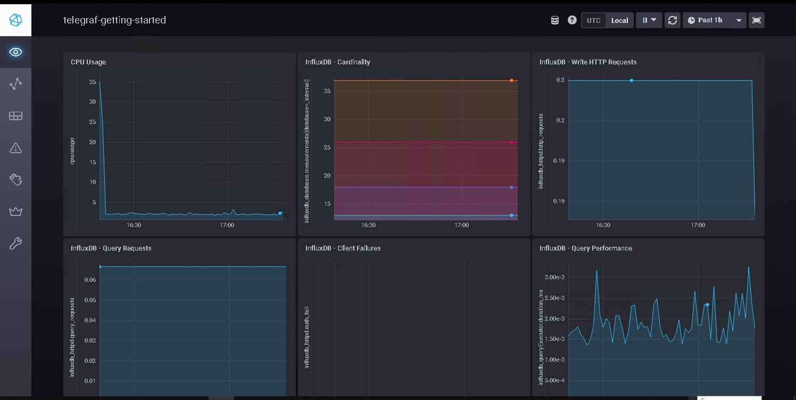
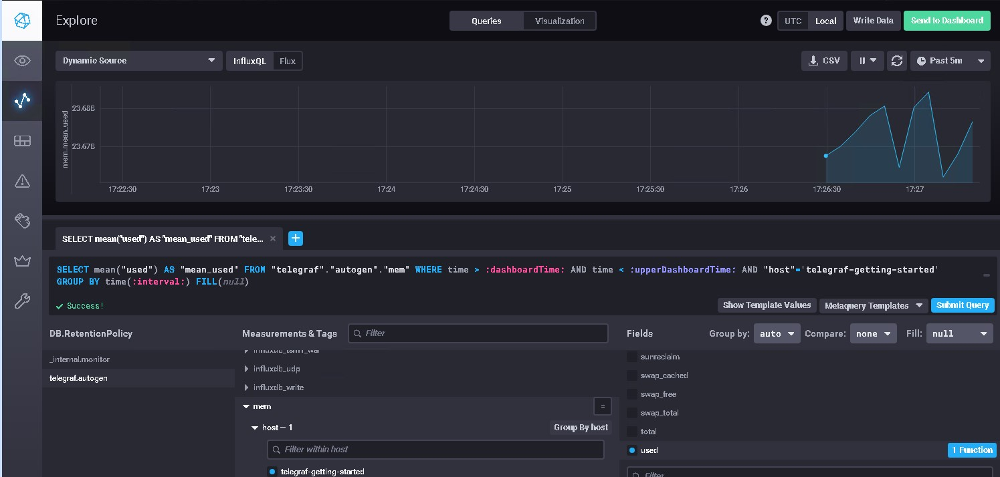

1.
Если следовать правилу, что мониторим только то, что нужно, и не следим за лишним, то набор будет такой:
Мониторинг OS
CPU:
CPU utilization
Load Average
RAM:
Memory utilization
Free swap space in %
DISK:
Space utilization
Free inodes in %
Disk write request avg waiting time
Disk read request avg waiting time
NET:
Загруженность интерфейсов (Bits received, Bits send)
Мониторинг App:
HTTP-запросы:
общее количество запросов
количество ошибочных запросов
время выполнения запросов (время отклика)


2.


RAM – оперативная память
Inodes - индексные дескрипторы. Их нехватка приведет к ошибке создания файла, да же если Space utilization еще не 100%
CPU LA - показатель средней нагрузки процессора по градации времени
Объясним менеджеру на его языке. Свяжем тех. метрики с бизнес-составляющей: SLO SLA SLI.
SLA - Если клиент не получил ожидаемый ответ от приложения, то значит бизнес бизнес несет убытки. Гарантируем, что ожидаемый ответ от приложения составляет не более 5 секунд.
SLO - Если мы заявляем, что 99% пользователей получат в нужный срок ожидаемый ответ от приложения. 1% - техническое обслуживание.
SLI : Расчет по ответу от приложения клиенту.
Успех: Запрос должен отдавать 200ые или 300ые коды в течение 5 секунд.
Неудача: нарушение любого условия (ответ или время)
SLI = (summ_2xx_requests_less_than_5_sec + summ_3xx_requests_less_than_5_sec) / (summ_all_requests)


3.
В таком случае, раз разработчики хотят видеть ошибки, то они должны реализовать в приложении систему файлового логирования, а еще лучше дополнительно доработать под работу с Sentry.
Можно предложить построить бюджетные схемы сбора логов:
Можно реализовать на бесплатном по OpenSearch и Sentry
Текстовые логи храним на сетевом диске (общая шара)
Пишем скрипт, который по шедулеру отлавливает в текстовых логах ошибки и отправляет их на почту. Просто и бесплатно реализован алертинг.

4.
Формула не верная, так как корректный ответ может быть не только 200ый, но и 300ый ( в теории и 100ые можно учесть)
Правильная формула:
(summ_1xx_requests + summ_2xx_requests + summ_3xx_requests)/summ_all_requests
Но скорее всего:
(summ_2xx_requests + summ_3xx_requests)/summ_all_requests

5.
Push
Плюсы:
Удобно использовать когда собирается большое количество метрик и неустойчивый канал связи между агентами и системой мониторинга.
Можно переключать передачу данных между udp и tcp, тем самым выбирая между экономией трафика или гарантией доставки.
Гибкая настройка частоты и объёма передаваемых метрик.
Можно использовать в динамически меняющемся окружении. (метрики с агентов сами будут поступать в систему мониторинга без её дополнительной настройки)

Pull
Плюсы:
Позволяет контролировать источники откуда принимать метрики.
Можно защитить канал связи между агентами и системой мониторинга шифрованием.
Упрощённая отладка получения метрик с агентов.

Минусы:
К минусам можно отнести сложность мониторинга динамически изменяющегося окружения


6.
Prometheus - Можно отправлять метрики по push модели при помощи push gateway, но Prometheus будет из забирать как pull
TICK - push
Zabbix - Оба варианта push и pull
VictoriaMetrics - push
Nagios - pull

-------------------
В виде решения на это упражнение приведите скриншот веб-интерфейса ПО chronograf (http://localhost:8888).
P.S.: если при запуске некоторые контейнеры будут падать с ошибкой - проставьте им режим Z, например
./data:/var/lib:Z


Для выполнения задания приведите скриншот с отображением метрик утилизации cpu из веб-интерфейса.



Добавьте в конфигурацию telegraf следующий плагин - docker:
```
endpoint = "unix:///var/run/docker.sock"
```

После настройке перезапустите telegraf, обновите веб интерфейс и приведите скриншотом список measurments в
веб-интерфейсе базы telegraf.autogen . Там должны появиться метрики, связанные с docker.
